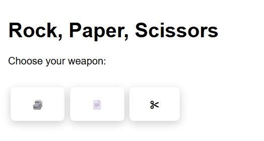
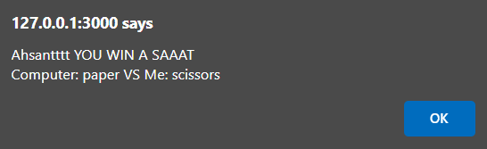

# TypeScriptPractice
Those challenges are from 'typescriptgamified' site :)
## Game 1: **Play Rock,Paper,Scissors Game**


`**it's like if you are playing with the computer!!`
`fach kanwarek 3la chi boutton lpc generates wa7ed randowm click puis on determine le gagnant**`



### NOTE1
```ts
const rockBtn = document.getElementById('rock');
if (rockBtn) {
    rockBtn.onclick = (ev: MouseEvent) => {
        const computerChoice = getComputerChoice();
        showResult('rock', computerChoice);
    }
}
```
`-> Explanation`

If the player clicks the rock button:

player = 'rock'

computer = getComputerChoice() → returns for example 'scissors'

showResult('rock', 'scissors') is called → shows "You win!"
### NOTE2
to get a random item from an array we usually use this pattern:
```ts
choices[Math.floor(Math.random() * choices.length)]
```
`-> Explanation`

**Math.random()**
→ gives a random number between 0 (included) and 1 (excluded)
→ `example:` 0.49, 0.72, etc.

**Math.random() * choices.length**
→ multiplies that random number by the array length (3 here)
→ now the result is between 0 and 2.999...

**Math.floor(...)**
→ removes the decimal part (rounds down)
→ now you get either 0, 1, or 2

**choices[...]**
→ uses that random index to pick from the array
→ choices[0] = 'rock', choices[1] = 'paper', choices[2] = 'scissors'